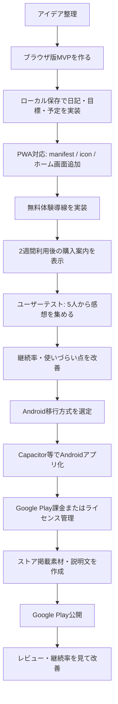

# 日記・目標・予定統合アプリ 要件定義

## 目的

日記、毎日の目標、予定表、リマインダーをひとつにまとめ、ユーザーが「今日やること」と「今日の記録」を無理なく続けられるアプリを作る。

まずはブラウザで動くPWAとして完成度を上げ、その後Androidアプリへ移行する。収益化は広告ではなく、2週間の無料体験後に買い切り購入へ誘導する方式を採用する。

## ターゲットユーザー

- 日記や習慣化を始めたいが、複数アプリを使い分けるのが面倒な人
- 毎日の目標、予定、記録を同じ画面で確認したい人
- 広告なしで落ち着いて使える個人管理アプリを求める人
- 学生、社会人、副業・勉強・健康習慣を管理したい人

## コア価値

- 1日単位で「目標」「予定」「日記」をまとめて見られる
- 毎日の目標をリマインダーで思い出せる
- 日記を書くことで、行動と気持ちの記録が残る
- 広告なし、買い切りで安心して長く使える

## ステップアップフローチャート

## 開発ロードマップ

### Phase 1: ブラウザ版MVP

- 日記の作成、編集、削除
- 今日の目標の作成、チェック、保存
- 予定の作成、編集、削除
- カレンダー表示
- 予定リマインダー
- LocalStorageなどによる端末内保存
- スマホ幅で快適に使えるUI

完了条件:

- スマホブラウザで日常利用できる
- 主要データが再読み込み後も保持される
- ホーム画面に追加してアプリ風に使える

### Phase 2: 継続利用を高める改善

- 日記検索
- 目標の達成率表示
- 連続達成日数
- 今日の未完了目標の通知
- 予定がある日のカレンダー表示
- データのエクスポート

完了条件:

- ユーザーが「続ける理由」を感じられる
- 2週間の体験で価値が伝わる

### Phase 3: 収益化導線

- 初回起動日を保存
- 14日間の無料体験期間を表示
- 体験終了後に購入案内を表示
- 購入前でもデータを失わない設計
- 買い切り購入の価値説明

推奨価格:

- 初期価格: 300円から600円
- 改善後: 600円から980円

購入訴求:

- 広告なし
- 日記・目標・予定をまとめて管理
- データを自分の端末で管理
- 一度買えば長く使える

### Phase 4: Androidアプリ化

- PWAをCapacitorでAndroidプロジェクト化
- Android通知への対応
- Google Play Billingの導入
- アプリアイコン、スクリーンショット、説明文の整備
- 内部テスト、クローズドテスト、公開

完了条件:

- Google Playに提出できるAPK/AABが作成できる
- 無料体験後の買い切り導線が動作する

## 機能要件

### 日記

- 日付ごとに日記を書ける
- 保存、編集、削除ができる
- 過去の日記を検索できる
- カレンダーから対象日を選択できる

### 毎日の目標

- 今日の目標を複数登録できる
- 達成チェックができる
- 達成状況を日付ごとに保存できる
- 継続目標を設定できる
- 目標リマインダーを設定できる

### 予定表

- 日付、時刻、予定名、メモを登録できる
- 予定の編集、削除ができる
- カレンダー上で予定の有無が分かる
- 予定前に通知できる

### リマインダー

- 日記を書く時間を通知できる
- 目標確認の時間を通知できる
- 予定の指定分前に通知できる
- 通知許可がない場合はアプリ内表示で代替する

### 課金・体験

- 初回利用日から14日間を無料体験期間とする
- 体験中はすべての基本機能を使える
- 体験終了後は購入画面を表示する
- 購入済みユーザーは制限なく利用できる
- 広告は表示しない

## 非機能要件

- スマホ画面で片手操作しやすい
- オフラインでも主要機能が使える
- データ保存処理が速い
- 入力中の内容を失いにくい
- プライベートな日記データを外部送信しない
- Android移行を前提にPWA構成を保つ

## データ項目

### DayData

- date: 日付
- diary: 日記本文
- goals: その日の目標一覧
- schedules: その日の予定一覧
- mood: 気分記録、将来追加候補

### Goal

- id: ID
- title: 目標名
- done: 達成状態
- reminderTime: 通知時刻
- repeat: 繰り返し設定

### Schedule

- id: ID
- title: 予定名
- date: 日付
- time: 時刻
- memo: メモ
- reminder: 何分前に通知するか

### License

- firstLaunchAt: 初回起動日
- trialEndsAt: 体験終了日
- purchased: 購入済みか
- purchaseProvider: 課金方式

## 画面要件

- ホーム画面: 今日の目標、今日の予定、日記入力への導線
- 日記画面: 日付選択、本文入力、検索
- 目標画面: 目標追加、達成チェック、継続状況
- カレンダー画面: 月表示、予定確認、日付選択
- 設定画面: 通知時刻、データ管理、購入状態
- 購入画面: 無料体験残日数、買い切り購入説明

## MVPでやらないこと

- SNS共有
- 他ユーザーとの連携
- AI日記分析
- クラウド同期
- サブスクリプション課金
- 広告表示

## リリース前チェックリスト

- `manifest.json` にアプリ名、テーマカラー、アイコンが設定されている
- `icon-192.png` と `icon-512.png` が存在する
- スマホブラウザでUIが崩れない
- 日記、目標、予定が保存される
- 通知許可の案内が分かりやすい
- 無料体験の開始日と終了日が正しく扱える
- 購入前後でユーザーデータが消えない
- Google Play用のスクリーンショットと説明文を用意する

